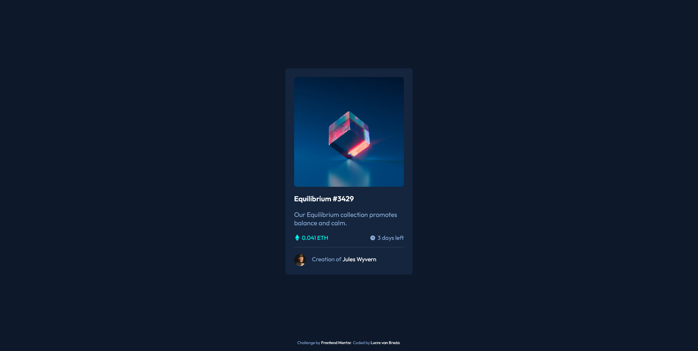

# Frontend Mentor - NFT preview card component solution

This is a solution to the [NFT preview card component challenge on Frontend Mentor](https://www.frontendmentor.io/challenges/nft-preview-card-component-SbdUL_w0U). Frontend Mentor challenges help you improve your coding skills by building realistic projects. 

## Table of contents

- [Overview](#overview)
  - [The challenge](#the-challenge)
  - [Screenshot](#screenshot)
  - [Links](#links)
- [My process](#my-process)
  - [Built with](#built-with)
- [Author](#author)

## Overview

### The challenge

Users should be able to:

- View the optimal layout depending on their device's screen size
- See hover states for interactive elements

### Screenshot

### Links

- Solution URL: [https://github.com/lucrevb1/challenges/tree/main/nft-preview-card-component-main](https://github.com/lucrevb1/challenges/tree/main/nft-preview-card-component-main)
- Live Site URL: [https://laughing-hawking-a1d967.netlify.app/nft-preview-card-component-main/index.html](https://laughing-hawking-a1d967.netlify.app/nft-preview-card-component-main/index.html)

## My process

I started with the html provided, resturtured it how I wanted then started adding the basic styling: font-family, card alignment, spacing, layout and colors. Next I dealt with the smaller details will text alignment spacing, image sizing and hover.
Lasting I added some transitions.

### Built with

- HTML5 markup
- Sass
- Mobile-first workflow

## Author

- Frontend Mentor - [@lucrevb1](https://www.frontendmentor.io/profile/lucrevb1)
- Twitter - [@the9avenger9](https://twitter.com/the9avenger9)

